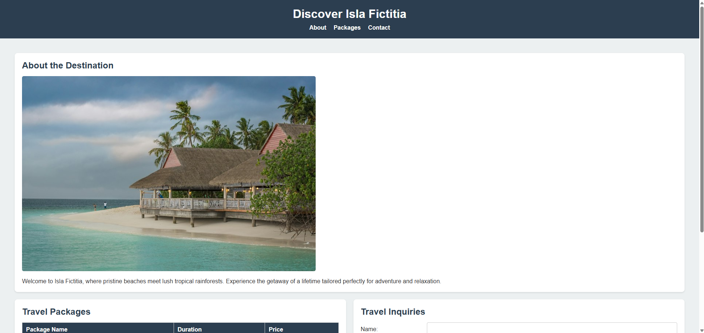
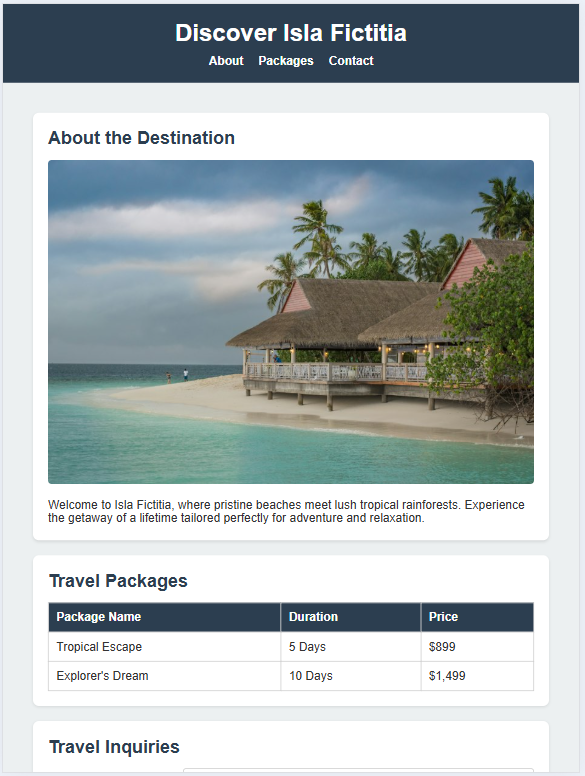
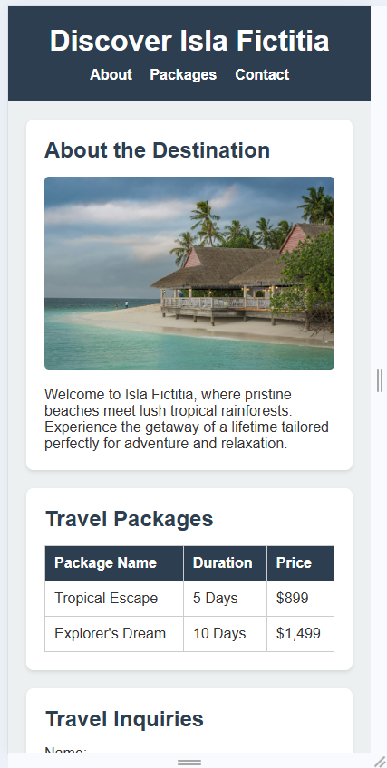

# Isla Fictitia Travel Brochure

## Overview
This project is a responsive and visually appealing travel brochure for a fictional destination, "Isla Fictitia." It was built to demonstrate fundamental skills in semantic HTML, CSS styling, and modern layout techniques like CSS Grid and Flexbox, all without the use of JavaScript.

## Features
*   **Semantic HTML:** Structured properly using elements like `<header>`, `<main>`, `<section>`, `<article>`, and `<footer>`.
*   **CSS Variables:** Implements a consistent design system using `--primary-color`, `--secondary-color`, `--text-color`, and more in the `:root` pseudo-class.
*   **Responsive Layout:** Adapts seamlessly to mobile, tablet, and desktop screens using CSS Media Queries.
*   **Grid & Flexbox:** Utilizes CSS Grid for the main page structure and Flexbox for navigation and form alignment.
*   **Travel Form & Table:** Includes a styled travel inquiry form and a pricing table for different vacation packages.

## Live Demo
*The site is hosted on GitHub Pages.* 
**https://kabiri-umd.github.io/CIS435-Fall2026-travel-brochure-project/**

## Previews

Here is how the application looks across different device viewports:

### Desktop View (>= 1024px)

### Tablet View (768px - 1023px)

### Mobile View (<= 768px)
